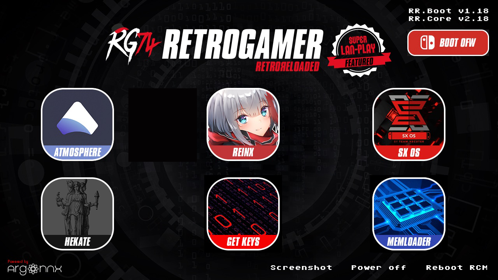
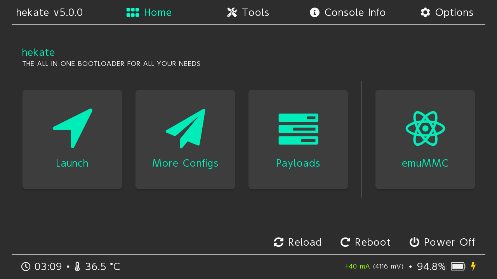
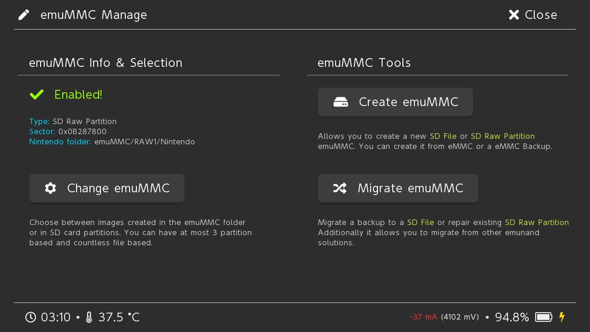
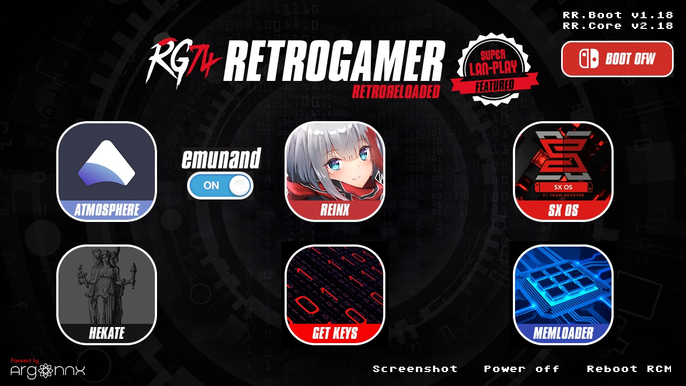

# RetroPack
RetroPack - Image with RetroReloaded + Emunand + Android

# Why RetroPack?

Simple. Instead having 2 SD cards, one for switch, and one for android, RetroPack brings you both solutions in one SD.

# Installation

Because of the heavy work to prepare the partitions, and the mandatory use of Linux to do it, I thought the best way would be to pack the result in an image ready for download.

And it is like that.

There will be 2 flavors of RetroPack and several options depending of what you want and the size of your microSD card.

## Flavour Red ( RetroPack Red )

RetroPack Red is ready to use with EmuMMC and Android. Partitio for EmuMMC is already reserved to be installed.

### Steps for red flavours

1 .- The first time you boot up RetroPack, which in fact will boot using RetroReloaded, you will see there is no emunand button close to Atmosphere icon. This is because emummc must be created from your own switch.

To do this, you have to touch Hekate option.

2.- Once in Hekate, touch emuMMC option.

3.- On the right side, touch, Create emuMMC

4.- Now select SD Partition button.

5.- Then continue.

6.- And that's all. When the procedure ends, which usually takes around 10 minutes, you can touch Close at the right top corner, and press Back to RR in the footer, to reload RetroReloaded again.

7.- Once on RetroReloaded you will see this time emunand button.

8.- For booting up Android, just touch Hekate button, and in the Launch option, select in the right side SwitchRoot Android.

#### Your download

Here is the link to all the RetroPack packages. Remember to select your Flavour and Size for your microSD.

[RetroPack Images](https://mega.nz/#F!TvYyGS5D!4CRLomt3FVgD2c4UvcB_fQ)
